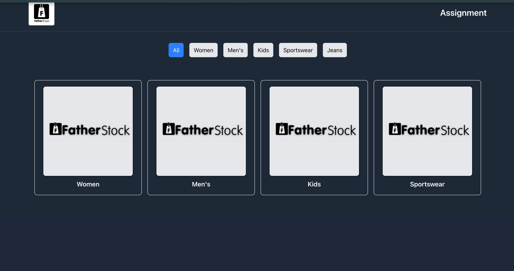
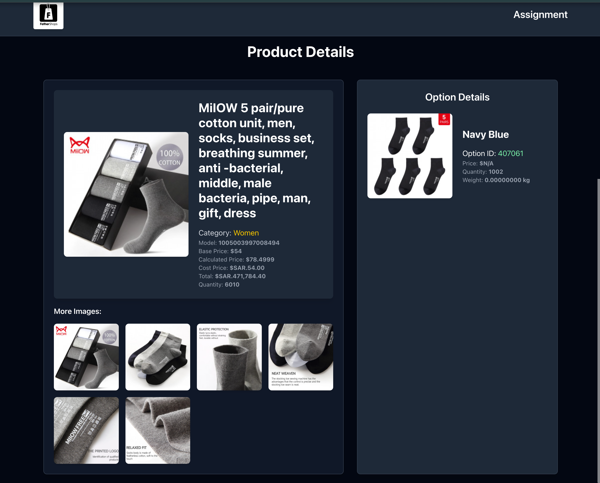

# How To Run

1. Clone the repository:

   ```bash
   git clone https://github.com/r4rishabh/FatherShop_Assignment.git

   ```

2. Move into the project directory

   ```bash
   cd Assignment_FatherShop

   ```

3. Install dependencies:

   ```bash
   npm install

   ```

4. Run the Development Server
   ```bash
   npm run dev
   ```

# Below are the Screenshots of the UI







<!-- - [@vitejs/plugin-react](https://github.com/vitejs/vite-plugin-react/blob/main/packages/plugin-react/README.md) uses [Babel](https://babeljs.io/) for Fast Refresh
- [@vitejs/plugin-react-swc](https://github.com/vitejs/vite-plugin-react-swc) uses [SWC](https://swc.rs/) for Fast Refresh

## Expanding the ESLint configuration

If you are developing a production application, we recommend using TypeScript and enable type-aware lint rules. Check out the [TS template](https://github.com/vitejs/vite/tree/main/packages/create-vite/template-react-ts) to integrate TypeScript and [`typescript-eslint`](https://typescript-eslint.io) in your project. -->
